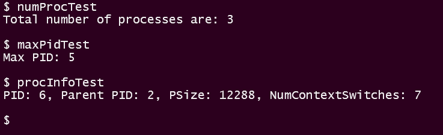
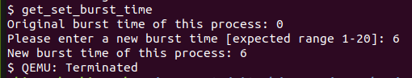

## Part A: 

Refer the patch files in [Patch/PartA/](./Patch/PartA/)

For creating the system calls, we needed to change these files:- 
* `user.h `- The function prototypes of our system calls (for user-space) were added in this file  
* `defs.h `- The function prototypes of our system calls (for kernel-space) were added in this file  
* `syscall.h `- The mapping from system call names to system call numbers were added in this file
* `syscall.c `- The mapping from system call numbers to system call functions were added in this file
* `usys.S `- The system call names were added in this file
* `sysproc.c `- The definition of system calls were added in this file and the file `processInfo.h` was included 
* `proc.c `- Since the struct `ptable` and other utility functions for process management were in this file, the main code for system calls was added in this file
* `proc.h `- 2 extra fields were added in the struct `proc` to keep store the number of context switches and burst time of the process 


### Syscall getNumProc 
The main code for this syscall can be found in the file `proc.c`. We have looped through all the slots of the `ptable's proc array` of the  and incremented the counter when we found a proc slot with a state other than UNUSED. Before iterating through the `proc` array we acquired the lock and released it after it. This is done to ensure that another process doesn't modify the ptable while we are iterating through it.  
```C
// proc.c
int                                         // line 546                     
getNumProc(void)
{
	int c = 0;
	struct proc *p;
	acquire(&ptable.lock);
	for(p = ptable.proc; p < &ptable.proc[NPROC]; p++){
		if(p->state != UNUSED)
		c++;
	}
	release(&ptable.lock);
	return c;
}
```
---


### Syscall getMaxPid
The main code for this syscall can be found in the file `proc.c`. We have looped through all the slots of the `proc` array of the `ptable` and found the maximum of all the process with a state other than UNUSED. Before iterating through the `proc` array we acquired the lock and released it after it. This is done to ensure that another process doesn't modify the ptable while we are iterating through it.  
```C
// proc.c
int                                         // line 563               
getMaxPid(void)
{
	int maxPID = -1;
	struct proc *p;
	acquire(&ptable.lock);
	for(p = ptable.proc; p < &ptable.proc[NPROC]; p++){
		if(p->state != UNUSED && p->pid > maxPID)
		maxPID = p->pid;
	}
	release(&ptable.lock);
	return maxPID;
}
```
---
### Syscall getProcInfo

We added another an extra field `numcs` in the struct `proc` to keep track of the number of context switches of a process

```C
// proc.h
int numcs;                                    // line 52             
```
We have initialized the `numcs` field of a process to 0 in the function `allocproc()`. 
```C
// proc.c
p->numcs = 0;                                 // line 95             
```
We have incremented the `numcs` field of a process everytime the scheduler schedules that process.  
```C
// proc.c
p->numcs++;                                   // line 351             
```

The main code for this syscall can be found in the function file `proc.c`. We have linearly searched for the PID in the `proc` array of the `ptable` and copied the required information into the struct `processInfo`. It returns 0 if PID is found and -1 otherwise. Before iterating through the `proc` array we acquired the lock and released it after it. This is done to ensure that another process doesn't modify the ptable while we are iterating through it.  

```C
// proc.c
int                                         // line 580             
getProcInfo(int pid, struct processInfo* pi)
{
  struct proc *p = 0;
  int found = 0;
  acquire(&ptable.lock);
  for(p = ptable.proc; p < &ptable.proc[NPROC]; p++){
    if(p->state != UNUSED && p->pid == pid){
        pi->ppid = p->parent->pid;
        pi->psize = p->sz;
        pi->numberContextSwitches = p->ncs;
        found = 1;
        break;
      }
  }
  release(&ptable.lock);
  if(found) return 0;
  return -1;
}
```


### Syscall get_burst_time

We added another an extra field `burstTime` in the struct `proc` to keep track of the burst time of the process

```C
// proc.h
int burstTime;                                // line 52             
```
We have initialized the `burstTime` field of a process to 0 in the function `allocproc()`. 
```C
// proc.c
p->burstTime = 0;                             // line 96             
```

The main code for this syscall can be found in the file `proc.c`. We simply use the pointer to the currently running process which is returned by myproc(), with which we read the burstTime propertly of the process.
```C
// proc.c
int											  // line 602
get_burst_time()
{
  return myproc()->burstTime;
}
```
---


### Syscall set_burst_time
The main code for this syscall can be found in the file `proc.c`. We first confirm that the burst time being set is positive (othewise return error status) then use the pointer to the currently running process which is returned by myproc(), with which we set the `burstTime` field of the process.
```C
// proc.c
int											  // line 611
set_burst_time(int n)
{
  // Burst Time should be a positive integer
  if (n < 1)
    return -1;

  myproc()->burstTime = n;
  return 0;
}
```
---


---
## User-level Application for our System Calls
For testing our system calls, we created 4 user-level applications -
* `numProcTest` for testing `getNumProc()`  
* `maxPidTest` for testing `getMaxPid()`  
* `procInfoTest` for testing `getProcInfo()`
* `get_set_burst_time` for testing both `get_burst_time()` and `set_burst_time()` 

For creating the user-level application, we need to make some changes in the `MakeFile` and create the `c` files for the user-level application.

In [Makefile](Patch/PartA/Makefile) we need to add our user-level applications to `UPROGS` and `EXTRA	`.

```makefile
// Makefile
UPROGS=\
	_cat\
	_echo\
	_forktest\
	_grep\
	_init\
	_kill\
	_ln\
	_ls\
	_mkdir\
	_rm\
	_sh\
	_stressfs\
	_usertests\
	_wc\
	_zombie\
	_numProcTest\                                                                                   	# line 184
	_maxPidTest\
	_procInfoTest\     
  	_get_set_burst_time\                                                         
	
EXTRA=\
	mkfs.c ulib.c user.h cat.c echo.c forktest.c grep.c kill.c\
	ln.c ls.c mkdir.c rm.c stressfs.c usertests.c wc.c zombie.c\
	printf.c umalloc.c numProcTest.c maxPidTest.c procInfoTest.c get_set_burst_time.c\          		# line 257
	
```

### numProcTest 
We created [numProcTest.c](Patch/PartA/wolfietest.c) in which we simply printed the output of the system call `getNumProc` to the console using `printf`. 1st parameter in `printf` is file descriptor which is 1 for console out. At the end we used `exit` system call to exit from this program.

```C
// numProcTest.c
#include "types.h"
#include "user.h"

int main(int argc, char *argv[]){
    printf(1, "Total number of processes are: %d\n\n", getNumProc());
    exit();
}
```


### maxPidTest 
We created [maxPidTest.c](./Patch/PartA/wolfietest.c) in which we simply printed the output of the system call `getMaxPid` to the console using `printf`. At the end we used `exit` system call to exit from this program.

```C
// maxPidTest.c
#include "types.h"
#include "user.h"

int main(int argc, char *argv[]){
    printf(1, "Max PID: %d\n\n", getMaxPid());
    exit();
}
```

### procInfoTest 
We created [procInfoTest.c](Patch/PartA/wolfietest.c) in which we use the syscall getMaxPid to get the Max PID, then use the system call `getProcInfo` to get Info about the process with that PID and then print the values of the fields of the struct `processInfo` to the console using `printf`. We included `processInfo.h` as we are using the struct `processInfo`. At the end we used `exit` system call to exit from this program.

```C
// procInfoTest.c
#include "types.h"
#include "user.h"
#include "processInfo.h"

int main(int argc, char *argv[]){
    struct processInfo pi;
    int pid = getMaxPid();
    if(getProcInfo(pid, &pi) != -1){
        printf(1,"PID: %d, Parent PID: %d, PSize: %d, NumContextSwitches: %d\n\n", pid, pi.ppid, pi.psize, pi.numberContextSwitches);
    }
    
    exit();
}
```

### get_set_burst_time
We created [get_set_burst_time.c](./Patch/PartA/get_set_burst_time.c) in which we first print the current burst time for this process (whose default value is 0), using the system call `get_burst_time`. Then we take user input for the new burst time to be set and after some validation use this input to set the new burst time using the system call `set_burst_time`, while passing the new value. Finally, we again use `get_burst_time` to demostrate that the burst time has indeed been set correctly.

```C
// get_set_burst_time.c
#include "types.h"
#include "user.h"

int getBurstTimeInput() {
    printf(1, "Please enter a new burst time [expected range 1-20]: ");
    
    char buf[18];
    int amt = read(0, buf, 18);
    
    if (amt > 5) 
        return -1;
    
    buf[amt] = 0;
    for (int i=0; buf[i]&&buf[i]!='\n'; i++)
        if (buf[i]<'0' || buf[i]>'9')
            return -1;

    int bTime = 0;
    for (int i=0; buf[i]&&buf[i]!='\n'; i++)
        bTime = bTime*10 + (int)(buf[i]-'0');

    return bTime;
}

int main(int argc, char *argv[]){
    // Show original burst time
    printf(1, "Original burst time of this process: %d\n", get_burst_time());
    
    // Read and set new burst time
    int bTime = getBurstTimeInput();
    if (bTime < 0) {
        printf(1, "[-] Invalid burst time set. Aborting!!\n");
        exit();
    }
    set_burst_time(bTime);
    
    // Print new burst time
    printf(1, "New burst time of this process: %d\n", get_burst_time());
    exit();
}
```




---
