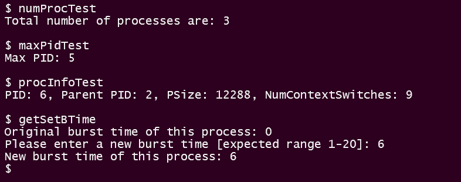

## Part A: 

Refer the patch files in [Patch/PartA/](./Patch/PartA/)

For creating the system calls, we needed to change these files:- 
* `user.h `- The function prototypes of our system calls (for user-space) were added in this file at line 27
<!-- ```C
// user.h
int getProcNum(void);                       // line 27 
int getMaxPid(void);
int getProcInfo(struct processInfo*);
int get_burst_time(void);
int set_burst_time(int);
``` -->
* `defs.h `- The function prototypes of our system calls (for kernel-space) were added in this file at line 124
<!-- ```C
// defs.h
int             getNumProc(void);           // line 124
int             getMaxPid(void);
int             getProcInfo(int, struct processInfo*);
int             get_burst_time(void);
int             set_burst_time(int);
``` -->

* `syscall.h `- The mapping from system call names to system call numbers were added in this file at line 23
<!-- ```C
// syscall.h
#define SYS_getNumProc  22                  // line 23
#define SYS_getMaxPid  23
#define SYS_getProcInfo  24
#define SYS_get_burst_time 25
#define SYS_set_burst_time 26
``` -->
* `syscall.c `- The mapping from system call numbers to system call functions were added in this file at line 106 and line 134
<!-- ```C
// syscall.c
extern int sys_getNumProc(void);            // line 106
extern int sys_getMaxPid(void);
extern int sys_getProcInfo(void);
extern int sys_get_burst_time(void);
extern int sys_set_burst_time(void);

[SYS_getProcNum] sys_getProcNum,            // line 134
[SYS_getMaxPid] sys_getMaxPid,
[SYS_getProcInfo] sys_getProcInfo,
[SYS_get_burst_time] sys_get_burst_time,
[SYS_set_burst_time] sys_set_burst_time,
``` -->
* `usys.S `- The system call names were added in this file at line 32
<!-- ```C
// usys.S
SYSCALL(getNumProc)                         // line 32
SYSCALL(getMaxPid)
SYSCALL(getProcInfo)
SYSCALL(get_burst_time)
SYSCALL(set_burst_time)
``` -->
* `proc.h `- 2 extra fields ie. `int numcs` and `burstTime` were added in the struct `proc` to keep track the number of context switches and burst time of the process 
<!-- ```C
// proc.h
int numcs;                                  // line 52
int burstTime;              
``` -->
* `sysproc.c `- The definition of system calls were added in this file and the file `processInfo.h` was included
* `proc.c `- Since the struct `ptable` and other utility functions for process management were in this file, the main code for system calls was added in this file

### Syscall getNumProc 

Function `sys_getNumProc(void)` was defined in file `sysproc.c` at line 95, which calls the function `getNumProc()` defined in `proc.c` and returns the value returned by it.
```C
// sysproc.c
int                                         // line 95
sys_getNumProc(void)
{
  return getNumProc();
}
```
The function `getNumProc` contains the main code for this syscall can be found in the file `proc.c` at line 546. We have looped through all the slots of the `ptable's proc array` of the  and incremented the counter whenever we find a proc slot with a state other than UNUSED. Before iterating through the `proc` array we acquired the lock and released it after it. This is done to ensure that another process doesn't modify the ptable while we are iterating through it.  
```C
// proc.c
int                                         // line 546                     
getNumProc(void)
{
	int c = 0;
	struct proc *p;
	acquire(&ptable.lock);
	for(p = ptable.proc; p < &ptable.proc[NPROC]; p++){
		if(p->state != UNUSED)
		c++;
	}
	release(&ptable.lock);
	return c;
}
```
---


### Syscall getMaxPid
Function `sys_getMaxPid(void)` was defined in file `sysproc.c` at line 103, which calls the function `getMaxPid()` defined in `proc.c` and returns the value returned by it.
```C
// sysproc.c
int                                         // line 103 
sys_getMaxPid(void)
{
  return getMaxPid();
}
```
The function `getMaxPid` contains the main code for this syscall can be found in the file `proc.c` at line 563. We have looped through all the slots of the `proc` array of the `ptable` and found the maximum of all the process with a state other than UNUSED. Before iterating through the `proc` array we acquired the lock and released it after it. This is done to ensure that another process doesn't modify the ptable while we are iterating through it.  
```C
// proc.c
int                                         // line 563               
getMaxPid(void)
{
	int maxPID = -1;
	struct proc *p;
	acquire(&ptable.lock);
	for(p = ptable.proc; p < &ptable.proc[NPROC]; p++){
		if(p->state != UNUSED && p->pid > maxPID)
		maxPID = p->pid;
	}
	release(&ptable.lock);
	return maxPID;
}
```
---
### Syscall getProcInfo

We added an extra field `numcs` in the struct `proc` to keep track of the number of context switches of a process

```C
// proc.h
int numcs;                                    // line 52             
```
We have initialized the `numcs` field of a process to 0 in the function `allocproc()`. This function is called while creating a process and hence, is called only once for a process.
```C
// proc.c
p->numcs = 0;                                 // line 95             
```
We have incremented the `numcs` field of a process everytime the scheduler schedules that process.
```C
// proc.c
p->numcs++;                                   // line 351             
```
Function `sys_getProcInfo(void)` was defined in file `sysproc.c` at line 112. It first gets the `pid` and `processInfo` struct pointer using `argint` and `arptr` resp. Then  calls the function `getProcInfo(pid, pi)` defined in `proc.c` and returns the value returned by it.
```C
// sysproc.c
int                                         // line 112
sys_getProcInfo(void)
{
  int pid;
  struct processInfo* pi;
  if(argint(0, &pid) < 0) return -1;
  if(argptr(1, (void*)&pi, sizeof(pi)) < 0) return -1;
  return getProcInfo(pid, pi);
}
```

The function `getProcInfo` contains the main code for this syscall can be found in the function file `proc.c` at line 580. We have linearly searched for the PID in the `proc` array of the `ptable` and copied the required information into the struct `processInfo` from the struct `proc`. It returns 0 if PID is found and -1 otherwise. Before iterating through the `proc` array we acquired the lock and released it after it. This is done to ensure that another process doesn't modify the ptable while we are iterating through it.  

```C
// proc.c
int                                         // line 580             
getProcInfo(int pid, struct processInfo* pi)
{
  struct proc *p = 0;
  int found = 0;
  acquire(&ptable.lock);
  for(p = ptable.proc; p < &ptable.proc[NPROC]; p++){
    if(p->state != UNUSED && p->pid == pid){
        pi->ppid = p->parent->pid;
        pi->psize = p->sz;
        pi->numberContextSwitches = p->ncs;
        found = 1;
        break;
      }
  }
  release(&ptable.lock);
  if(found) return 0;
  return -1;
}
```

---

### Syscall get_burst_time

We added an extra field `burstTime` in the struct `proc` to keep track of the burst time of the process.

```C
// proc.h
int burstTime;                                // line 52             
```
We have initialized the `burstTime` field of a process to 0 in the function `allocproc()`. This function is called while creating a process and hence, is called only once for a process.
```C
// proc.c
p->burstTime = 0;                             // line 96             
```

Function `sys_get_burst_time(void)` was defined in file `sysproc.c` at line 125, which calls the function `get_burst_time()` defined in `proc.c` and returns the value returned by it.
```C
// sysproc.c
int                                         // line 125
sys_get_burst_time(void)
{
  return get_burst_time();
}
```
The function `get_burst_time` contains the main code for this syscall can be found in the file `proc.c` at line 602. Since we have already mantained the burst time in the struct `proc`, we simply use the pointer to the currently running process which is returned by myproc(), with which we read the burstTime property of the process.
```C
// proc.c
int											  // line 602
get_burst_time()
{
  return myproc()->burstTime;
}
```
---


### Syscall set_burst_time

Function `sys_set_burst_time(void)` was defined in file `sysproc.c` at line 134. It first gets the argument burstTime `btime` using `argint`, then calls the function `set_burst_time(btime)` defined in `proc.c` and returns the value returned by it.
```C
// sysproc.c
int                                         // line 134
sys_set_burst_time(void)
{
  int btime;
  if(argint(0, &btime) < 0) return -1;
  return set_burst_time(btime);
}
```

The function `set_burst_time` contains the main code for this syscall can be found in the file `proc.c` at line 611. We first confirm that the burst time being set is positive (othewise return error status) then use the pointer to the currently running process which is returned by myproc(), with which we set the `burstTime` field of the process.
```C
// proc.c
int											  // line 611
set_burst_time(int n)
{
  // Burst Time should be a positive integer
  if (btime < 1)
    return -1;

  myproc()->burstTime = btime;
  return 0;
}
```
---


## User-level Application for our System Calls
For testing our system calls, we created 4 user-level applications -
* `numProcTest` for testing `getNumProc()`  
* `maxPidTest` for testing `getMaxPid()`  
* `procInfoTest` for testing `getProcInfo()`
* `getSetBTime` for testing both `get_burst_time()` and `set_burst_time()` 

For creating the user-level application, we need to make some changes in the `MakeFile` and create the `c` files for the user-level application.

In [Makefile](Patch/PartA/Makefile) we need to add our user-level applications to `UPROGS` and `EXTRA	`.

```makefile
// Makefile
	_numProcTest\                                                                            # line 184
	_maxPidTest\
	_procInfoTest\     
  	_getSetBTime\                                                         
	
EXTRA=\
	mkfs.c ulib.c user.h cat.c echo.c forktest.c grep.c kill.c\
	ln.c ls.c mkdir.c rm.c stressfs.c usertests.c wc.c zombie.c\
	printf.c umalloc.c numProcTest.c maxPidTest.c procInfoTest.c getSetBTime.c\          		# line 257
	
```

### numProcTest 
We created [numProcTest.c](Patch/PartA/wolfietest.c) in which we simply printed the output of the system call `getNumProc` to the console using `printf`. 1st parameter in `printf` is file descriptor which is 1 for console out. At the end we used `exit` system call to exit from this program.
<!-- 
```C
// numProcTest.c
#include "types.h"
#include "user.h"

int main(int argc, char *argv[]){
    printf(1, "Total number of processes are: %d\n\n", getNumProc());
    exit();
}
``` -->


### maxPidTest 
We created [maxPidTest.c](./Patch/PartA/wolfietest.c) in which we simply printed the output of the system call `getMaxPid` to the console. At the end we used `exit` system call to exit from this program.
<!-- 
```C
// maxPidTest.c
#include "types.h"
#include "user.h"

int main(int argc, char *argv[]){
    printf(1, "Max PID: %d\n\n", getMaxPid());
    exit();
}
``` -->

### procInfoTest 
We created [procInfoTest.c](Patch/PartA/wolfietest.c) in which we use the syscall getMaxPid to get the Max PID, then use the system call `getProcInfo` to get Info about the process with that PID and then print the values of the fields of the struct `processInfo` to the console. We included `processInfo.h` as we are using the struct `processInfo`. At the end we used `exit` system call to exit from this program.

<!-- ```C
// procInfoTest.c
#include "types.h"
#include "user.h"
#include "processInfo.h"

int main(int argc, char *argv[]){
    struct processInfo pi;
    int pid = getMaxPid();
    if(getProcInfo(pid, &pi) != -1){
        printf(1,"PID: %d, Parent PID: %d, PSize: %d, NumContextSwitches: %d\n\n", pid, pi.ppid, pi.psize, pi.numberContextSwitches);
    }
    
    exit();
}
``` -->

### getSetBTime
We created [getSetBTime.c](./Patch/PartA/getSetBTime.c) in which we first print the current burst time for this process (whose default value is 0), using the system call `get_burst_time`. Then we take user input for the new burst time to be set and after some validation use this input to set the new burst time using the system call `set_burst_time`, while passing the new value. Finally, we again use `get_burst_time` to demostrate that the burst time has indeed been set correctly.

<!-- ```C
// getSetBTime.c
#include "types.h"
#include "user.h"

int getBurstTimeInput() {
    printf(1, "Please enter a new burst time [expected range 1-20]: ");
    
    char buf[18];
    int amt = read(0, buf, 18);
    
    if (amt > 5) 
        return -1;
    
    buf[amt] = 0;
    for (int i=0; buf[i]&&buf[i]!='\n'; i++)
        if (buf[i]<'0' || buf[i]>'9')
            return -1;

    int bTime = 0;
    for (int i=0; buf[i]&&buf[i]!='\n'; i++)
        bTime = bTime*10 + (int)(buf[i]-'0');

    return bTime;
}

int main(int argc, char *argv[]){
    // Show original burst time
    printf(1, "Original burst time of this process: %d\n", get_burst_time());
    
    // Read and set new burst time
    int bTime = getBurstTimeInput();
    if (bTime < 0) {
        printf(1, "[-] Invalid burst time set. Aborting!!\n");
        exit();
    }
    set_burst_time(bTime);
    
    // Print new burst time
    printf(1, "New burst time of this process: %d\n", get_burst_time());
    exit();
}
``` -->



---

## Part B_1:  

Refer the patch files in [Patch/PartB1/](./Patch/PartB1/)

### Scheduler Implementation

This part require the default number of CPUs to simulate to be changed to 1. It was achieved by changing the constant `NCPU` to 1 in `param.h`

```c
//param.h
#define NCPU          1  // maximum number of CPUs 				#line3
```

The default scheduler of `xv6` was an unweighted round robin scheduler which preempts the current process after running it for certain fixed time (indicated by an interrupt from hardware timer). But the required scheduler needs to be shortest job first scheduler, so it was required to disable this preemption. It was achieved by commenting the following code from the file `traps.c`

```c
//if(myproc() && myproc()->state == RUNNING &&        // line 105
//   tf->trapno == T_IRQ0+IRQ_TIMER)
//  yield();
```

Since the burst time of a process was set by the process itself, so after setting up burst time the context needs to be switched back to the scheduler. To achieve this `yield` function (the currently running process is made to yield CPU) was called just before `return` statement of `set_burst_time()` in `proc.c`

```c
int
set_burst_time(int n)
{
  myproc()->burstTime = n;
  yield();
  return 0;
}
```

For implementing shortest job first scheduling the Ready Queue was implemented as a Priority Queue(min heap) so that finding the job with shortest burst time and inserting a new job into the list could be done in `O( log n ) ` where `n` is the number of processes in the ready queueu. 

In `proc.c` two new fields were added to `ptable` structure ie. the `priorityQueueArray`, which would store the pointers of the processes in the form of a min heap and `pqsize`, which is equal to the size of the ready queue at any point of time.

```c
struct {
  struct spinlock lock;
  struct proc proc[NPROC];
  struct proc* priorityQueueArray[NPROC];             
  int pqsize;                                         //size of Priority Queue
} ptable;
```

The Utility functions for Priority Queue were implemented in the file `proc.c` from line 18 to line 90.
<!-- 
```c
//proc.c

// Priority Queue Functions 
// Should be called only after acquiring ptable lock
// Ready Queue is implemented as a Priority Queue So as to find process with minimum burst time in O(log(n))

//Compare Function for processes 
//Compare based on burst time
int compProc(struct proc* proc1,struct proc* proc2){
  if(proc1->burstTime == proc2->burstTime)
    return (proc1->pid < proc2->pid);
  return proc1->burstTime < proc2->burstTime;
}

//helper function to swap two processes present in ptable
void swap(int i,int j){
  struct proc* temp = ptable.priorityQueueArray[i];
  ptable.priorityQueueArray[i] = ptable.priorityQueueArray[j];
  ptable.priorityQueueArray[j] = temp;
  return;
}

void priorityQueueHeapify(int curIndex){
  int leftChild = 2*curIndex+1;
  int rightChild = 2*curIndex+2;
  int nextIndex = curIndex;

  if(leftChild < ptable.pqsize && compProc(ptable.priorityQueueArray[leftChild],ptable.priorityQueueArray[nextIndex]))
    nextIndex=leftChild;
  
  if(rightChild < ptable.pqsize && compProc(ptable.priorityQueueArray[rightChild],ptable.priorityQueueArray[nextIndex]))
    nextIndex=rightChild;

  if(nextIndex != curIndex){
    swap(nextIndex,curIndex);
    priorityQueueHeapify(nextIndex);
  }
  return;
}

struct proc* priorityQueueExtractMin(){
  if(ptable.pqsize == 0)
    return 0;

  struct proc* minElt = ptable.priorityQueueArray[0];
  ptable.priorityQueueArray[0] = ptable.priorityQueueArray[ptable.pqsize - 1];
  ptable.pqsize--;
  priorityQueueHeapify(0);

  return minElt;
}

void priorityQueueInsert(struct proc* proc){
  int curIndex = ptable.pqsize++;
  ptable.priorityQueueArray[curIndex] = proc;

  while(curIndex > 0){
    int parentIndex = (curIndex-1)/2;
    if(compProc(ptable.priorityQueueArray[parentIndex],ptable.priorityQueueArray[curIndex]))
      break;
    swap(curIndex,parentIndex);
    curIndex = parentIndex;
  }

  return;
}

//helper function called when a process is added to ready queue(priority queue)
void makeProcRunnable(struct proc* proc){
  proc->state = RUNNABLE;
  priorityQueueInsert(proc);
}
``` -->

The function `makeProcRunnable()` was called whenever a process was made RUNNABLE. This function set the process state to runnable, and also added the process to the Ready Queue. This function was called at line 233, 299, 476, 551, 578 in the file `proc.c`. 
Following are the functions in which `makeProcRunnable()` was called:
* `userinit()` - The first process was added to the Ready Queue here
<!-- 
  ```c
    acquire(&ptable.lock);             //line 228
    ptable.pqsize = 0;
    makeProcRunnable(p);
    release(&ptable.lock);
  ``` -->

* `fork()` -  The newly created runnable process was added to Ready Queue here

  <!-- ```c
    acquire(&ptable.lock);           //line 297
    makeProcRunnable(np);
    release(&ptable.lock);
  ``` -->

*  `yield()` - In this function, the currently running process was made to yield CPU thereby making it runnable

  <!-- ```c
  // Give up the CPU for one scheduling round.
  void
  yield(void)
  {
    acquire(&ptable.lock);  //DOC: yieldlock
    makeProcRunnable(myproc());
    sched();
    release(&ptable.lock);
  }
  ``` -->

* `wakeup1()` - All sleeping process were made runnable in this function

  <!-- ```c
  static void
  wakeup1(void *chan)
  {
    struct proc *p;
  
    for(p = ptable.proc; p < &ptable.proc[NPROC]; p++)
      if(p->state == SLEEPING && p->chan == chan){
        makeProcRunnable(p);
      }
  }
  ``` -->

* `kill()` - In order to kill a sleeping process its first made runnable

  <!-- ```c
  // line 575
  
  // Wake process from sleep if necessary.
  if(p->state == SLEEPING){
      makeProcRunnable(p);
  }
  ``` -->

The function `scheduler` in `proc.c` was changed as follows in order to implement shortest job first scheduling. The following lines were changed inside the scheduler ie. line 419 to line 426. We first get the process with the minimum burst time from the Ready Queue using the `priorityQueueExtractMin()` function. If there is no runnable process, we release the lock and continue back into the `for loop` at line 413.

```c
    p = priorityQueueExtractMin();          // line 419  

    if(p==0) {  // No process is curently runnable
      release(&ptable.lock);
      continue;
    }

    cprintf("####### SCHEDULING - pid: %d  burstTime: %d\n", p->pid, p->burstTime);
```

For each iteration of outer `for` loop, the pointer to the process with  minimum burst time is extracted out of the Priority Queue. Since Priority is based upon burst time of processes, so the required process will be the min element of Priority Queue, hence function `priorityQueueExtractMin()` will return the same. If no runnable process exists then the NULL (or 0) pointer is returned and this corner case is handled separately in `if` block above. If the Ready Queue is non empty then the context is switched to the required process. 

### Testing 

The test file `test_scheduler.c` contains the following functions:

* `looper()`: This function simply runs the inner loop `loopfac` number of times. The inner loop runs with an empty body for 10^8 iteractions. Thus in total the number of iterations is `loopfac * 10^8`. It is a means to include an CPU-bound process
<!-- ```c
// Loop "loopfac" number of times         line 4
void looper(int bt, int loopfac) {
  set_burst_time(bt);        

  if (loopfac>5) 
    loopfac = 5;

  for (volatile int l=0; l<loopfac; l++)
    for (volatile int i=0; i<100000000; i++)
      ;

  getProcInfo();
  exit();
}
``` -->
* `userIO()`: This function simply takes the reader input from STDIN and prints it back on STDOUT. It is a means to include an IO-bound process, which waits for user input while the other processes can run.
<!-- ```c
// User IO                                 line 19
void userIO(int bt)
{
  set_burst_time(bt);

  char buf[256];
  printf(1, "Enter for user IO:\n");
  int amt = read(0, buf, 256);
  buf[amt] = 0;
  printf(1, "So you entered: %s", buf);

  getProcInfo(); 
  exit();
}
``` -->
* `fileIO()`: This function simply reads 1500 bytes from the README file from the xv6 file system and prints it to STDOUT. It is a means to include a file-IO bound process, which reads content while the other processes are RUNNABLE.
<!-- ```c
// File IO                                  line 34
void fileIO(int bt)
{
  set_burst_time(bt);

  int fd = open("README", 0);
  char buf[1500];
  read(fd, buf, 1500);
  buf[1499] = 0;
  printf(1, "1500 Words of README: \n%s\n---------\n", buf);

  getProcInfo(); 
  exit();
}
``` -->

The driver code is mainly responsible for creating 5 child processes and calling the above functions to perform different tasks in different child processes. It passes the required parameters like the burst time to be set and `loopfac` in case of CPU bound loop based processes. The code then uses the PIDs to determine and print a summary of the order in which the processes completed their execution.
<!-- ```c
int main(int argc, char *argv[])                // line 50
{
  int pid[5];
  int rpid[5];
  char exitInfoGatherer[5][70];

  if ( !(pid[0] = fork()) )  looper(6,2);
  if ( !(pid[1] = fork()) )  userIO(1);
  if ( !(pid[2] = fork()) )  looper(10,4);
  if ( !(pid[3] = fork()) )  fileIO(3);
  if ( !(pid[4] = fork()) )  looper(8,1);  

  for (int i=0; i<5; i++)
    rpid[i] = wait();

  strcpy(exitInfoGatherer[0], "BurstTime: 6  - Empty loop running 2e8 times\n");
  strcpy(exitInfoGatherer[1], "BurstTime: 1  - Taking user IO and printing it\n");
  strcpy(exitInfoGatherer[2], "BurstTime: 10 - Empty loop running 4e8 times\n");
  strcpy(exitInfoGatherer[3], "BurstTime: 3  - Reading from file and printing it\n");
  strcpy(exitInfoGatherer[4], "BurstTime: 8  - Empty loop running 1e8 times\n");

  printf(1, "\n******** CHILDREN EXIT ORDER SUMMARY ********\n");
  for (int i=0; i<5; i++) {
    for (int j=0; j<5; j++) {
      if (rpid[i] == pid[j])
        printf(1, exitInfoGatherer[j]);
    }
  }
  printf(1, "\n****** Summary ends, completing parent *******\n\n");

  getProcInfo();
	exit();
}
``` -->
Five child processes are being forked from the parent process, and their PIDs are being saved for later use (for printing the final order of execution):
1. A loop which runs 10^8 loop 2 times, and burst time set to 6.
2. A process for user IO, with burst time set to 1.
3. A loop which runs 10^8 loop 4 times, and burst time set to 10.
4. A process for user IO, with burst time set to 3.
5. A loop which runs 10^8 loop 1 time, and burst time set to 8.

When `test_scheduler.c` is run, various important observations are made:
* The parent process runs whenever it is not in the SLEEP state (ie. it has not called `wait()`). This is because by default the burst time is initialised to 0 for all processes, so the parent process (and other system process) get scheduled first as SJF here works on burst time.
* Each child process first sets its burst time, using a modified `set_burst_time` syscall, which sets its burst time and then calls `yield()` to preempt the child process. This is done because the burst time is being set inside the child process, and we want the child processes to actually start execution once all the child processes have been given burst times.
* Since there is a child which reads user input (the second prodess forked) and prints it, the order in which the child processes finish executing is _partly dependent_ on _when_ the user gives the input. It first performs some printing, then waits for the user to input something. This waiting time determines how long it would be SLEEPING (and hence, won't be RUNNABLE). Since it has the shortest burst time, as soon as the user input has been read, the next process that will be scheduled is this process. Hence a fast user input means this processes finishes quickly, otherwise it may even finish in the end. 
<!-- However, it is impossible for it to finish first, as there are pure CPU bound processes which once scheduled, will complete all the instructions without sleeping/waiting. -->