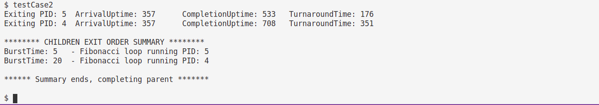

## Testing 

We used created 3 files for testing and examining our scheduler under varied circumstances to validate its robustness and take observations. The files are described below:

### testCase1.c

This file is used to study the behavior of implemented SJF scheduler when there is a mixture of **CPU bound and IO bound processes**.
The test file `testCase1.c` contains the following functions:

* `looper()`: This function simply runs the inner loop `loopfac` number of times. The inner loop runs with an empty body for 108 iterations. Thus in total the number of iterations is loopfac * 108. It is a means to include an CPU-bound process

* `userIO()`: This function simply takes the reader input from STDIN and prints it back on STDOUT. It is a means to include an IO-bound process, which waits for user input while the other processes can run.

* `fileIO()`: This function simply reads `readBytes` bytes from the file `filename` from the `Xv6` file system. It is a means to include a file-IO bound process, which reads content while the other processes are RUNNABLE.

The driver code is mainly responsible for creating 5 child processes and calling the above functions to perform different tasks in different child processes. It passes the required parameters like the burst time to be set and `loopfac` in case of CPU bound loop based processes. The code then uses the PIDs to determine and print a summary of the order in which the processes completed their execution.

Six child processes are being forked from the parent process, and their PIDs are being saved for later use (for printing the final order of execution):

1. A loop which runs 108 loop 2 times, and burst time set to 8.
2. A process for user IO, with burst time set to 1.
3. A loop which runs 108 loop 4 times, and burst time set to 10.
4. A process for file IO, where we read 1500 bytes, with burst time set to 5.
5. A loop which runs 108 loop 1 time, and burst time set to 6.
6. A process for file IO, where we read 500 bytes, with burst time set to 3.

When `testCase1.c` is run, various important observations are made:

* The parent process runs whenever it is not in the SLEEP state (that is it has not called `wait()`). This is because by default the burst time is initialized to 0 for all processes, so the parent process (and other system process) gets scheduled first as SJF here works on burst time.
* Each child process first sets its burst time, using a modified `set_burst_time` syscall, which sets its burst time and then calls `yield()` to preempt the child process. This is done because the burst time is being set inside the child process, and we want the child processes to actually start execution once all the child processes have been given burst times.
* Since there is a child which reads user input (the second process forked) and prints it, the order in which the child processes finish executing is _partly dependent_ on **when** the user gives the input. It first performs some printing, then waits for the user to input something. This waiting time determines how long it would be SLEEPING (and hence, won't be RUNNABLE). Since it has the shortest burst time, as soon as the user input has been read, the next process that will be scheduled is this process. Hence a fast user input means this processes finishes quickly, otherwise it may even finish in the end. 

**Screenshot:** In the screenshot below, we can see that even though the first process (PID: 14) has the least burst time, it _can not_ complete execution because it is waiting for user IO and hence in SLEEPING state. Hence, it can only resume once the user gives the Input. After which it gets executed.

---
### testCase2.c

This file is used to illustrate the **significance of the burst time** of the process in the order of execution of the processes waiting to be run.

For this test, we have used the predefined system call `uptime()`, which tells us the number of ticks passed upto _NOW_. Using this syscall we have calculated the `turnaround time`, `responsiveness` of processes.

A function called `childProcess()` is called by a newly forked child which performs extensive CPU based calculation, more specifically it calculates the 3 * 108 th term of the fibonacci sequence (modulo 109+7).

The `main` function forks two processes and for each of them calls `childProcess()`.
Each child process before the actual execution starts a timer using the `uptime()` system call, sets the burst time and preempts itself back to the ready queue (i.e. becomes runnable). Then it completes the above fibonacci computation and before exiting stops the timer (i.e. again calls `uptime()` and computes the difference with above `uptime()` value) and prints its status.

Initially both the child processes are forked and the driver process after creating them waits for them to finish (after calling `wait()`). These child processes then start timer and set burst time. Once both have obtained the _positive_ burst times and driver process is waiting, the child with the lower burst time is scheduled. Once it completes executing, the other child executes. This is clearly reflected in the output too. 

_Note_ that as default burst time is 0, the driver code/parent process (which has this default burst time) gets scheduled when it is available.

**_Qualitatively:_** (see summary in output) the one with lower burst time is executed first.

**_Quantitatively:_** (see output before summary) the turnaround time (time it took to complete its execution after being ready for execution) for the second process is almost _double_ the turnaround time for the first process. This is due to the fact that both the processes are ready for execution at almost the same time and one process executes itself while the other one waits for its execution and then is executed.

---
### testCase3.c

This file is used illustrate the **difference between default round robin scheduler and the shortest job first scheduler**. Five child processes are being forked from the parent process :

* 2 D loop running 8 X 10000000 times with burst time 10
* loop running 500000000 times and calculating Fibonacci number with burst time 15 
* 3 D loop running 1000 X 1000 X 1000 times with burst time 18
* 2 D loop running 2 X 500000000 times with burst time 19
* loop running 1000000000 times and calculating Fibonacci number with burst time 20

The above program is run on `Xv6` with SJF (Shortest Job First) scheduler and with Round Robin scheduler independently. Output obtained is given below:

* Shortest Job First scheduler 

  

* Round Robin scheduler

  

Two significant differences are being observed:

* The difference in Completion Time of consecutive(in order of completion) child processes with large burst times is more in case Shortest Job First scheduler as compared to that of Round Robin scheduler. This is because Shortest Job First scheduling is non preemptive that is there is a context switch from currently running process if and only if the currently running process gets terminated or it is waiting for a resource (in case of I/O). So for the above processes in SJF, where there is no waiting for resource involved, next process starts only when the previous one has been terminated. In other words the difference between Completion Time of consecutive(in order of completion) two processes is actually the time for which later one was running. Whereas in the case of Round Robin scheduling which is preemptive, every process is run for fixed amount of time and then a context switch takes place. So by the time any of the larger burst time processes is going to end, almost all the other remaining processes must have been executed in equal proportion and would have less number of instructions left to be completed, hence they are completed in close values of absolute times(therefore less difference) as compared to SJF scheduling (in whose case at time of completion of any process none of the later processes would have been executed).

  However difference in(even absolute value) Completion Time of initial few consecutive(in order of completion) child processes is more for Round Robin scheduler as compared to that SJF scheduler. The reason for this behavior is that initially time gets divided among many processes, so effectively for same absolute value of time initial processes(in order of completion)  gets executed for a less duration of time in Round Robin Scheduler as compared to SJF scheduler, hence they end little later and have higher value of difference in Completion Time.

* In case of Round Robin scheduler process with burst time 18 is completed after process with burst time 20 whereas in case of Shortest Job First scheduler processes are completed in the ascending order of their burst times. This is because in the implementation of SJF scheduling it is guaranteed that processes are scheduling in ascending order of their burst times and since SJF scheduling is non preemptive, the processes are completed in the same order of their burst times. But in case of preemptive Round Robin scheduling time gets divided equally among all running processes, so the order of completion of processes is almost same as the order of time of execution for each process. Since the processes with burst time 18,19, and 20 are almost similar in terms of number of iterations (that is 1000000000), and it is the case that the process with burst time 18 gets executed for a little longer (depending on the exact code, compiler, loop unrolling, hardware, etc) as compared to the other two processes, hence it is completed at the last.